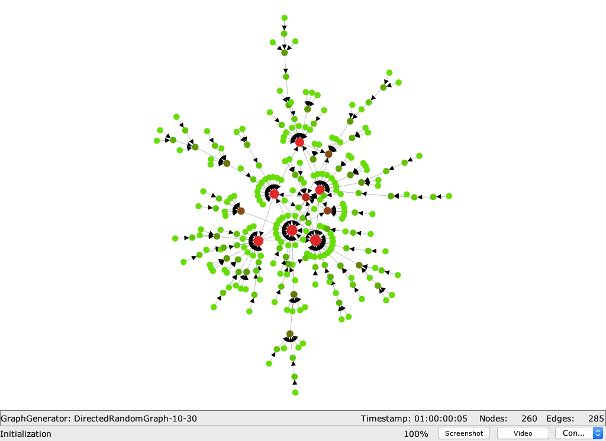

# DNA.graphVisualization

In this repository, we provide java codes and built jars for visualizing dynamic graphs using DNA.
These graphs can be either read from various formats or tenerated on-the-fly.

In total, four different versions of the visualization are provided, each in a separate jar file:

1. `visualization.jar` - displaying the graph
2. `screenshots.jar` - screenshots (png) for the initial graph and after each batch
3. `gif.jar` - after create screenshots, an animated git is created from them
4. `video.jar` - a video (avi) is generated form the graph

All jars can be downloaded from [http://dynamic-networks.org/data/jars/DNA.graphVisualization/](http://dynamic-networks.org/data/jars/DNA.graphVisualization/).

## visualization.jar

	expecting 9 arguments (got 0)
	   0: gdsType - type of gds to use (String)
	      values:  Directed DirectedV DirectedE DirectedVE Undirected UndirectedV UndirectedE UndirectedVE
	
	   1: gdsArgs - arguments for the gds (String[]) sep. by ','
	
	   2: graphType - type of graph to generate (String)
	      values:  Clique Grid2d Grid3d HoneyComb Ring RingStar Star Random BarabasiAlbert PositiveFeedbackPreference ReadableEdgeListFileGraph Timestamped
	
	   3: graphArgs - arguments for the graph generator (String[]) sep. by ','
	
	   4: batchType - type of batches to generate (String)
	      values:  BarabasiAlbert PositiveFeedbackPreference RandomGrowth RandomScaling Random RandomW RandomEdgeExchange Timestamped
	
	   5: batchArgs - arguments for the batch generator (String[]) sep. by ','
	
	   6: seed - seed to initialize the PRNG with (Long)
	
	   7: batches - number of batches to generate (Integer)
	
	   8: sleepBetween - time in ms to sleep between batches (Long)

## screenshots.jar

	expecting 10 arguments (got 0)
	   0: gdsType - type of gds to use (String)
	      values:  Directed DirectedV DirectedE DirectedVE Undirected UndirectedV UndirectedE UndirectedVE
	
	   1: gdsArgs - arguments for the gds (String[]) sep. by ','
	
	   2: graphType - type of graph to generate (String)
	      values:  Clique Grid2d Grid3d HoneyComb Ring RingStar Star Random BarabasiAlbert PositiveFeedbackPreference ReadableEdgeListFileGraph Timestamped
	
	   3: graphArgs - arguments for the graph generator (String[]) sep. by ','
	
	   4: batchType - type of batches to generate (String)
	      values:  BarabasiAlbert PositiveFeedbackPreference RandomGrowth RandomScaling Random RandomW RandomEdgeExchange Timestamped
	
	   5: batchArgs - arguments for the batch generator (String[]) sep. by ','
	
	   6: seed - seed to initialize the PRNG with (Long)
	
	   7: batches - number of batches to generate (Integer)
	
	   8: sleepBetween - time in ms to sleep between batches (Long)
	
	   9: screenshotsDir - dir where to store the screenshots (String)

## gif.jar

	expecting 12 arguments (got 0)
	   0: gdsType - type of gds to use (String)
	      values:  Directed DirectedV DirectedE DirectedVE Undirected UndirectedV UndirectedE UndirectedVE
	
	   1: gdsArgs - arguments for the gds (String[]) sep. by ','
	
	   2: graphType - type of graph to generate (String)
	      values:  Clique Grid2d Grid3d HoneyComb Ring RingStar Star Random BarabasiAlbert PositiveFeedbackPreference ReadableEdgeListFileGraph Timestamped
	
	   3: graphArgs - arguments for the graph generator (String[]) sep. by ','
	
	   4: batchType - type of batches to generate (String)
	      values:  BarabasiAlbert PositiveFeedbackPreference RandomGrowth RandomScaling Random RandomW RandomEdgeExchange Timestamped
	
	   5: batchArgs - arguments for the batch generator (String[]) sep. by ','
	
	   6: seed - seed to initialize the PRNG with (Long)
	
	   7: batches - number of batches to generate (Integer)
	
	   8: sleepBetween - time in ms to sleep between batches (Long)
	
	   9: screenshotsDir - dir where to store the screenshots (String)
	
	  10: gifFilename - filename of the gif to generate (without .gif at the end) (String)
	
	  11: gifDelay - delay between images, 1 for 0.01 sec, 10 for 0.1 sec, 100 for 1 sec, etc. (Integer)

## video.jar

	expecting 11 arguments (got 0)
	   0: gdsType - type of gds to use (String)
	      values:  Directed DirectedV DirectedE DirectedVE Undirected UndirectedV UndirectedE UndirectedVE
	
	   1: gdsArgs - arguments for the gds (String[]) sep. by ','
	
	   2: graphType - type of graph to generate (String)
	      values:  Clique Grid2d Grid3d HoneyComb Ring RingStar Star Random BarabasiAlbert PositiveFeedbackPreference ReadableEdgeListFileGraph Timestamped
	
	   3: graphArgs - arguments for the graph generator (String[]) sep. by ','
	
	   4: batchType - type of batches to generate (String)
	      values:  BarabasiAlbert PositiveFeedbackPreference RandomGrowth RandomScaling Random RandomW RandomEdgeExchange Timestamped
	
	   5: batchArgs - arguments for the batch generator (String[]) sep. by ','
	
	   6: seed - seed to initialize the PRNG with (Long)
	
	   7: batches - number of batches to generate (Integer)
	
	   8: sleepBetween - time in ms to sleep between batches (Long)
	
	   9: videoDir - dir where to store the video (String)
	
	  10: videoFilename - filename of the video (without suffix) (String)

## examples

### video

	java -jar video.jar Undirected - Random 10,30 BarabasiAlbert 20,1 0 10 0 ../examples/video/ video

result: [examples/video/video.avi](examples/video/video.avi)

### gif

	java -jar gif.jar Undirected - Random 10,30 BarabasiAlbert 5,1 0 50 0 ../examples/gif/ _animated 10

result: [examples/gif/](examples/gif/)

### screenshots
	
	java -jar screenshots.jar Directed - Random 10,30 BarabasiAlbert 50,1 0 5 1000 ../examples/screenshots/

result: [examples/screenshots/](examples/screenshots/)

